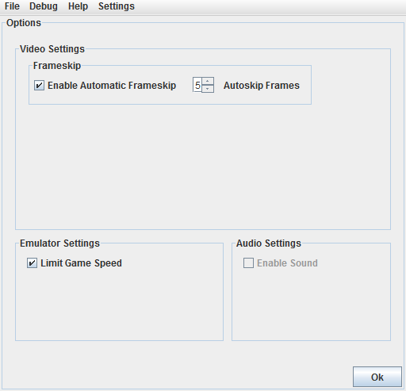
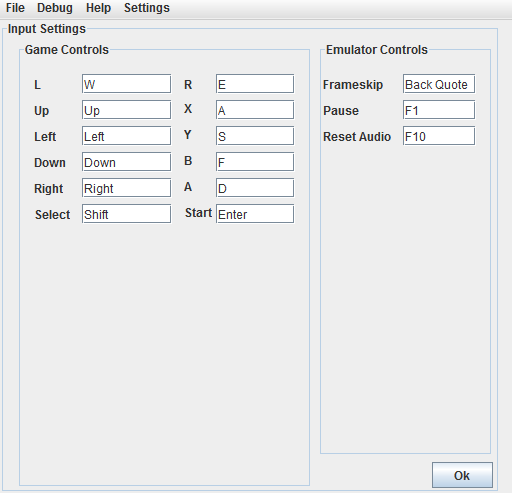

# Configuration

SNO offers several options for configuring your gameplay experience.

## Options

The options screen allows you to control certain aspects of the emulator. It is accessed by the **Settings->Options** menu entry.

Enable Automatic Frameskip
: Automatic Frameskip skips rendering of a certain amount of frames when the emulator is running slow. This can help improve game performance, but animations will be jumpy and less smooth as a result.

Autoskip Frames
: Sets the amount of frames to skip when frameskip is enabled.

Limit Game Speed
: When checked, this attempts to match the original SNES speed. If unchecked, games will run as fast as they can, and may run faster than the original SNES.

Enable Sound
: Controls audio output. Audio is unimplemented in SNO, thus this option is disabled.

## Input

The input screen allows you to change the keyboard keys that map to the SNES controller, as well as other emulator controls. It is accessed by the **Settings->Input** menu entry.

To change a setting, click the box next to the button or action that you wish to change, and press the key that you want to map to that button or action.

Game Controls
: The SNES controller. These keys are the primary method of controlling SNES games and correspond to buttons on the SNES controller.

Frameskip
: When held down, this key temporarily activates automatic frameskip, if it is not already available.

Pause
: Toggles the pause function. When paused, the game does not progress until you unpause it by pressing the pause button again.

Reset Audio
: Resets the audio system. Although not output, SNO emulates some sound functionality. Some games may become unresponsive due to errors with the sound system. Pressing this key will reset the sound system and may help fix freezes in some games. 