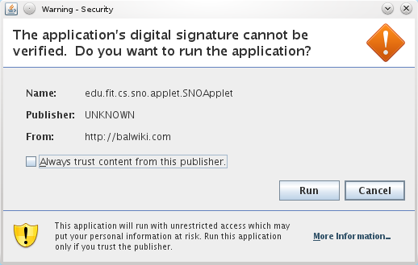
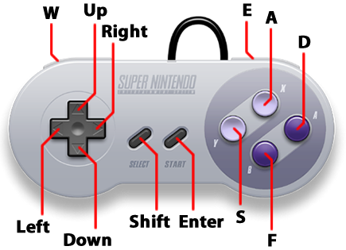

# How to Play

SNO supports playing several popular Super Nintendo games. This section covers how to play a Super Nintendo game on a website that uses SNO.

Note that this guide does NOT cover game-specific topics. Only generic Super Nintendo functions are covered.

## Starting Up

When you first arrive on a page using SNO, you may receive a warning dialog that looks like the dialog below. This dialog is prompting you to allow SNO to run on your computer. To continue, click the "Run" or "Yes" buttons to allow SNO to run.

If the website has linked SNO to a ROM file, SNO will automatically load and play the game; you can start playing right away!

Super Nintendo ROMs typically end with the ".smc" extension. SNO can also open zipped ROM files.

### Loading your own Game

Alternatively, you can load a ROM file stored on your own computer using the File -> Open menu in the menu bar. When selected, a file dialog will appear. Use the dialog to select the ROM file that you wish to play. Confirm your choice and SNO will load the ROM file and begin playing the game you selected.

## Playing

SNO maps keys on your keyboard to the buttons on an SNES controller. After the game has started, click on the game screen to ensure that it will respond to your keyboard.

Site owners may change the controls for SNO; the ones shown here are the defaults.

### Controls

This following image and table show the default controls for SNO. Note that you can change the controls to whatever configuration you like; how this is done is explained on the [Configuration page](configuration.html).

SNES Controller | Keyboard
--------------- | --------------
D-Pad           | Arrow Keys
A Button        | D Key
B Button        | F Key
X Button        | A Key         
Y Button        | S Key
R Bumper        | W Key
L Bumper        | E Key
Start           | Enter / Return
Select          | Shift

### Gameplay

Each SNES game differs in terms of gameplay. Many games include instructions that explain how to play. If you are having trouble playing a game, game help sites, like [GameFAQs](http://www.gamefaqs.com/), may have more information.